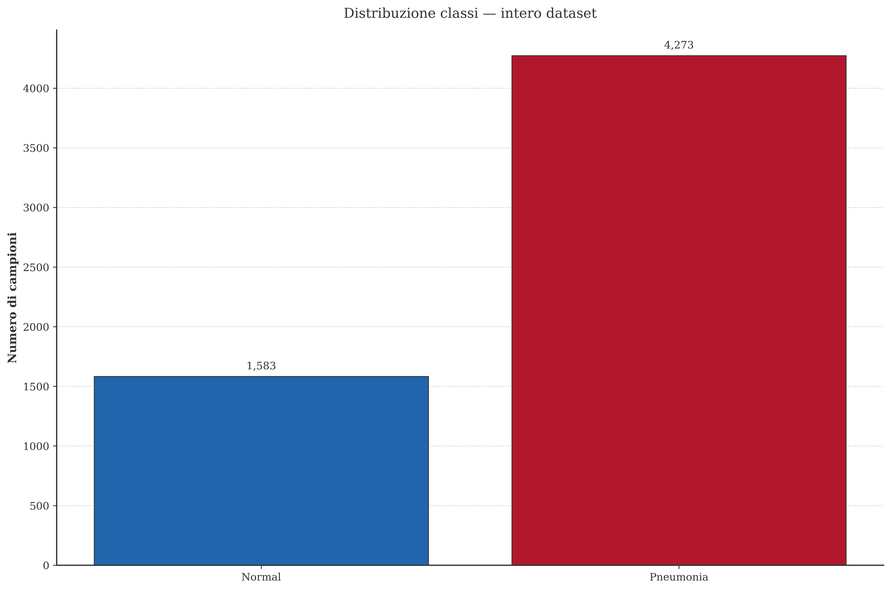
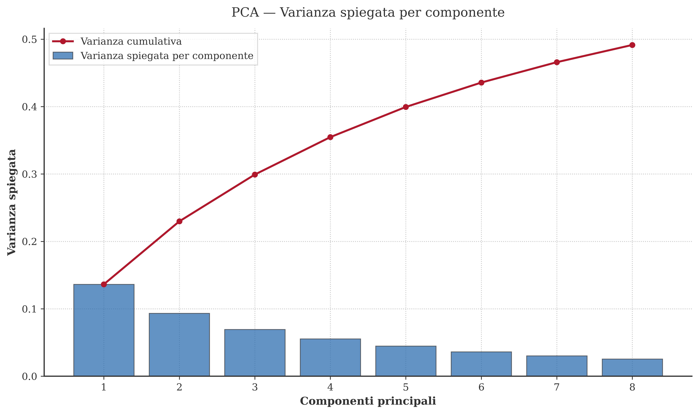
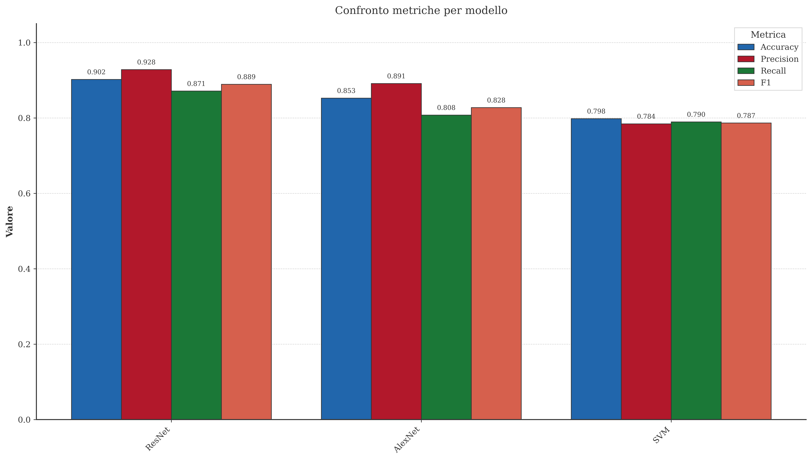
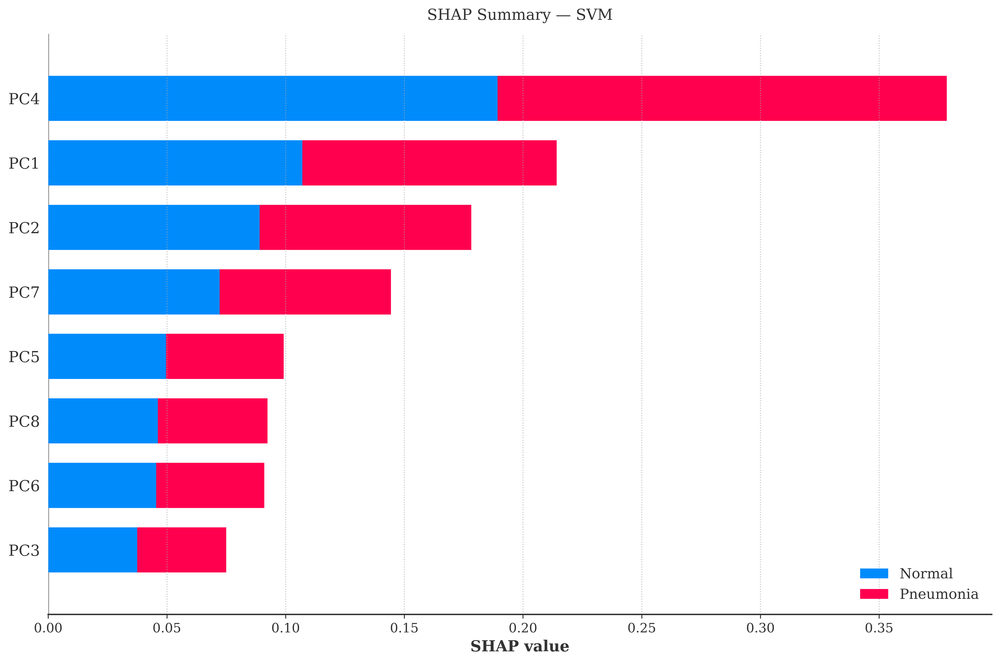

# Chest X-Ray Classification
## Deep Learning e SVM applicati alla Diagnosi Medica

> Classificazione automatica di radiografie toraciche pediatriche in configurazione binaria (NORMAL / PNEUMONIA) e ternaria (BACTERIA / NORMAL / VIRUS) mediante reti neurali profonde (ResNet, AlexNet) e Support Vector Machine con rappresentazioni estratte da un Vision Transformer pre-addestrato.


Pipeline sperimentale per la classificazione di radiografie toraciche, fondata su:
- ~5.856 immagini JPEG acquisite su pazienti pediatrici (1–5 anni, Guangzhou)
- Confronto sistematico tra approcci di Deep Learning e Support Vector Machine potenziato da rappresentazioni ViT
- Modalità **binaria** (NORMAL / PNEUMONIA) e **ternaria** (BACTERIA / NORMAL / VIRUS)

###### **Obiettivo: valutare e comparare quantitativamente le prestazioni di ResNet, AlexNet e SVM su dati radiologici reali, corredando l'analisi di tecniche di interpretabilità (SHAP) e di quantificazione dell'incertezza predittiva (MC Dropout)**.

##### Risultati ottenuti

<div align="center">

<table>
  <tr>
    <th>Modello</th>
    <th>Accuracy</th>
    <th>F1 Macro</th>
    <th>Precision Macro</th>
    <th>Recall Macro</th>
    <th>Loss</th>
    <th>Train Time (s)</th>
  </tr>

  <tr>
    <td>ResNet</td>
    <td>—</td>
    <td>—</td>
    <td>—</td>
    <td>—</td>
    <td>—</td>
    <td>—</td>
  </tr>

  <tr>
    <td>AlexNet</td>
    <td>—</td>
    <td>—</td>
    <td>—</td>
    <td>—</td>
    <td>—</td>
    <td>—</td>
  </tr>

  <tr>
    <td>SVM (ViT + PCA + SMOTE)</td>
    <td>—</td>
    <td>—</td>
    <td>—</td>
    <td>—</td>
    <td>—</td>
    <td>—</td>
  </tr>

</table>

</div>

<p align="center">
  
  
</p>

<p align="center">
  
  
</p>

<p align="center">
  <em>Prima riga: distribuzione delle classi e PCA Scree Plot. Seconda riga: confronto tra modelli e SHAP Summary (SVM).</em>
</p>

##### Key Insights

- L'architettura residuale (ResNet) mitiga in modo più efficace il problema del vanishing gradient rispetto ad AlexNet, grazie all'impiego delle connessioni skip
- L'SVM con rappresentazioni ViT consegue performance competitive pur non richiedendo risorse GPU durante la fase di inferenza
- Le componenti principali a maggiore varianza spiegata esibiscono il più elevato potere discriminante nella separazione tra classi

##### Configurabilità
Tutti i parametri sperimentali sono centralizzati e modificabili nel file `config/config.yaml`, senza necessità di intervenire sul codice sorgente.

---

## Introduzione

Il presente elaborato è stato sviluppato nell'ambito dell'esame di Machine Learning, previsto dal piano di studi del Corso di Laurea Magistrale presso l'Università degli Studi di Enna Kore.

Il lavoro propone un framework per la classificazione automatica di radiografie toraciche pediatriche mediante tecniche di Deep Learning e Machine Learning classico. Il sistema supporta due modalità operative: classificazione ternaria, finalizzata a distinguere le polmoniti batteriche (BACTERIA) da quelle virali (VIRUS) rispetto ai casi normali (NORMAL); e classificazione binaria, volta a discriminare i soggetti sani (NORMAL) dai pazienti affetti da polmonite (PNEUMONIA).

I dati impiegati provengono dal dataset pubblico [Chest X-Ray Images (Pneumonia)](https://www.kaggle.com/datasets/paultimothymooney/chest-xray-pneumonia), disponibile su Kaggle e raccolto presso il Guangzhou Women and Children's Medical Center. Il corpus comprende circa 5.856 immagini JPEG ripartite nei set di training, validazione e test.

Sono posti a confronto tre approcci metodologici: ResNet (rete neurale convoluzionale con connessioni residue), AlexNet (architettura CNN classica) e SVM (Support Vector Machine con rappresentazioni estratte da un Vision Transformer pre-addestrato, riduzione dimensionale via PCA e bilanciamento del training set tramite SMOTE).

---

## Indice

1. [Prerequisiti](#1-prerequisiti)
2. [Installazione](#2-installazione)
3. [Esecuzione](#3-esecuzione)
4. [Struttura del progetto](#4-struttura-del-progetto)
5. [Le 5 fasi della pipeline](#5-le-5-fasi-della-pipeline)
6. [Configurazione](#6-configurazione)
7. [Output prodotti](#7-output-prodotti)
8. [Licenza MIT](#8-licenza-mit)
9. [Contatti](#9-contatti)

---

## 1. Prerequisiti

- **Python 3.11+** installato e disponibile da terminale (`python --version`)
- **Connessione internet** (per scaricare il dataset da Kaggle alla prima esecuzione)
- **GPU CUDA** raccomandata per il training DL (il codice funziona anche su CPU)
- **Account Kaggle** gratuito (credenziali API per il download automatico del dataset)

Il dataset viene acquisito automaticamente mediante le API ufficiali Kaggle. Qualora il file **kaggle.json** non risulti ancora configurato nel proprio ambiente di lavoro, è necessario seguire la procedura riportata di seguito.

### Passo 1 — Creare un account Kaggle

Qualora non si disponga già di un account, è possibile registrarsi gratuitamente su [kaggle.com](https://www.kaggle.com/).

### Passo 2 — Generare la API Key

1. Creare una cartella al path:

```
C:\Users\<TUO_UTENTE>\.kaggle
```

2. Navigare alla pagina [kaggle.com/settings](https://www.kaggle.com/settings)
3. Scorrere fino alla sezione **API**
4. Cliccare su **"Create New Token"**
5. Conservare la chiave esadecimale appena generata

### Passo 3 — Configurare la API

6. Andare al path `C:\Users\<TUO_UTENTE>\.kaggle` e creare, al suo interno, un file `kaggle.json`
7. Inserire all'interno del file il seguente contenuto:

```json
{"username": "il_tuo_username", "key": "una_stringa_esadecimale"}
```

### Passo 4 — Verificare il funzionamento

Al termine della configurazione, è possibile verificare il corretto funzionamento eseguendo da terminale i seguenti comandi:

```bash
pip install kaggle
kaggle datasets list
```

La comparsa di una lista di dataset attesta la corretta configurazione delle credenziali.

### Passo 5 (opzionale) — Token Hugging Face

Il modello SVM si avvale del Vision Transformer `google/vit-base-patch16-224` per l'estrazione di rappresentazioni dense. Il download dei pesi avviene automaticamente da Hugging Face anche in assenza di autenticazione; tuttavia, il possesso di un token personale incrementa la velocità di trasferimento ed elimina il rischio di throttling da parte del servizio.

1. Creare un token *Read* su [huggingface.co/settings/tokens](https://huggingface.co/settings/tokens)
2. Eseguire da terminale (con il venv attivo):

```bash
hf auth login
```

3. Incollare il token nella finestra di dialogo quando richiesto.

---

## 2. Installazione

### Metodo rapido (Windows)

Il progetto include un file denominato **`prepare.bat`**. È sufficiente eseguire da terminale il seguente comando:

```bat
.\prepare.bat
```

In questo modo, lo script:

1. Crea un virtual environment in `.venv/`
2. Lo attiva
3. Installa tutte le dipendenze da `requirements.txt`
4. Reinstalla PyTorch con supporto CUDA 12.8

### Metodo manuale (Windows)

```bash
# Crea il virtual environment
python -m venv .venv

# Attiva il virtual environment
# Su Windows (cmd):
.venv\Scripts\activate
# Su Windows (PowerShell):
.venv\Scripts\Activate.ps1

# Installa le dipendenze
python.exe -m pip install --upgrade pip
pip install -r requirements.txt
```

### Metodo rapido (Linux / macOS)

```bash
bash prepare.sh
```

In questo modo, lo script:

1. Crea un virtual environment in `.venv/`
2. Lo attiva
3. Installa tutte le dipendenze da `requirements.txt`

### Metodo manuale (Linux / macOS)

```bash
# Crea il virtual environment
python -m venv .venv

# Attiva il virtual environment
source .venv/bin/activate

# Installa le dipendenze
python -m pip install --upgrade pip
pip install -r requirements.txt
```

---

## 3. Esecuzione

> **Importante:** verificare che il virtual environment risulti attivo prima di lanciare qualsiasi comando. In assenza della cartella `.venv/` nella root del progetto, eseguire preventivamente la procedura di installazione descritta nella sezione precedente.

```bash
# Su Windows (cmd):
.venv\Scripts\activate
# Su Windows (PowerShell):
.venv\Scripts\Activate.ps1
# Su Linux/macOS:
source .venv/bin/activate
```

### Pipeline completa

Per avviare in sequenza l'intera pipeline (tutte e 5 le fasi):

```bash
python main.py
```

### Pipeline veloce (consigliata per il primo test)

Esegue la pipeline completa limitando il training a 5 epoche. Raccomandata come test di sanità prima di procedere con l'addestramento definitivo:

```bash
python main.py --quick
```

### Eseguire una singola fase

```bash
python main.py --phase 1    # Solo caricamento dati e visualizzazione esplorativa
python main.py --phase 2    # Solo training Deep Learning (ResNet, AlexNet)
python main.py --phase 3    # Solo training SVM
python main.py --phase 4    # Solo interpretabilità (SHAP) e uncertainty (MC Dropout)
python main.py --phase 5    # Solo valutazione finale e confronto tra modelli
```

### Eseguire più fasi selezionate

```bash
python main.py --phases 1 2 3    # Fasi 1, 2 e 3
```

### Usare una configurazione custom

```bash
python main.py --config config/mia_config.yaml
```

---

## 4. Struttura del progetto

```
chest-x-ray-classification/
│
├── main.py                  # Entry point — pipeline a 5 fasi
├── requirements.txt         # Dipendenze Python
├── prepare.bat              # Script di setup automatico (Windows)
├── prepare.sh               # Script di setup automatico (Linux/macOS)
├── README.md                # Questo file
├── LICENSE                  # MIT License
├── .gitignore
│
├── config/
│   └── config.yaml          # Configurazione centralizzata
│
├── data_classes/
│   └── data_loader.py       # Download Kaggle + preprocessing + costruzione DataLoader
│
├── models/
│   ├── resnet_model.py      # Architettura ResNet con connessioni residuali
│   ├── alexnet_model.py     # Architettura AlexNet classica
│   └── svm_model.py         # ViT embeddings + PCA + SMOTE + SVM
│
├── utils/
│   ├── evaluation.py        # Metriche, tabella comparativa, report finale
│   ├── interpretability.py  # Analisi SHAP (KernelExplainer su SVM)
│   └── uncertainty.py       # MC Dropout e uncertainty quantification
│
├── plot/
│   └── visualization.py     # Grafici IEEE-ready
│
├── data/                    # Dataset (generato automaticamente al primo avvio)
│
├── docs/                    # Documentazione tecnica dei moduli
│
├── .github/                 # Immagini per questo file
│
└── outs/
    ├── imgs/                # Grafici generati (.png), suddivisi in sottocartelle
    ├── models/              # Pesi salvati (.pt, .pkl, pca.joblib)
    ├── logs/                # Log di esecuzione (run.log)
    └── results/             # CSV e report testuali
```

---

## 5. Le 5 fasi della pipeline

### Fase 1 — Caricamento dati e visualizzazione esplorativa

In questa fase il dataset viene scaricato da Kaggle (esclusivamente alla prima esecuzione) nella directory `data/chest_xray/`. Il sistema riorganizza automaticamente la struttura delle cartelle in funzione della modalità di classificazione selezionata (binaria o ternaria) e ridistribuisce i campioni tra training, validation e test set; tale ridistribuzione si rende necessaria in ragione del marcato sbilanciamento di classe presente nella suddivisione originale. La struttura è reversibile: la modifica del parametro `classification.type` nel file di configurazione comporta la riesecuzione automatica della conversione alla successiva esecuzione.

### Fase 2 — Training modelli Deep Learning

Vengono addestrati i modelli di Deep Learning specificati in `models.to_train` (ResNet e/o AlexNet). Il bilanciamento delle classi durante il training è assicurato da un `WeightedRandomSampler` ponderato in base alla frequenza relativa di ciascuna classe. Il learning rate è gestito tramite uno scheduler con warmup lineare nella fase iniziale e decay lineare nelle epoche successive. È implementato l'early stopping sulla metrica di validazione, anch'essa configurabile in `config/config.yaml`. Il miglior checkpoint viene serializzato in `outs/models/` e per ogni modello vengono prodotti i grafici delle curve di training in una sottocartella dedicata.

### Fase 3 — Training modello SVM

Vengono estratte rappresentazioni dense a 768 dimensioni da ciascuna immagine mediante il Vision Transformer pre-addestrato `google/vit-base-patch16-224`. Alle rappresentazioni estratte viene applicata la Principal Component Analysis per la riduzione dimensionale (numero di componenti configurabile in `config/config.yaml`). Il training set viene successivamente bilanciato tramite SMOTE (Synthetic Minority Oversampling Technique). Ultimata la fase di preprocessing, si procede all'addestramento del classificatore SVM con kernel RBF. Il modello addestrato e la trasformazione PCA vengono serializzati e persistiti in `outs/models/`.

### Fase 4 — Interpretabilità e Uncertainty

Viene condotta una **SHAP Analysis** (`KernelExplainer`) per identificare le componenti PCA che maggiormente determinano la predizione dell'SVM per ogni classe, producendo un summary plot aggregato, un bar plot di importanza media e un plot per singola classe. La quantificazione dell'incertezza predittiva è realizzata mediante **MC Dropout**, eseguendo N forward pass stocastici con dropout attivo (N configurabile in `config/config.yaml`) su ResNet e AlexNet per l'intero test set. Viene infine tracciata una **Rejection curve** che illustra la variazione dell'accuracy in funzione della soglia di entropia adottata per il filtraggio delle predizioni incerte. I grafici relativi all'incertezza sono organizzati in sottocartelle per modello.

### Fase 5 — Valutazione finale e confronto

Al termine di tutte le fasi di addestramento e valutazione, viene prodotta una tabella comparativa comprendente le seguenti metriche per ciascun modello: accuracy, precision (macro), recall (macro), F1-score (macro) e loss. I file `model_comparison.csv` e `classification_reports.txt` vengono archiviati in `outs/results/`. Per ogni modello vengono prodotte la matrice di confusione e le curve ROC one-vs-rest, corredate da grafici di confronto complessivo a barre orizzontali per singola metrica e a barre raggruppate per modello.

---

## 6. Configurazione

Tutti i parametri sperimentali sono centralizzati in **`config/config.yaml`** e possono essere modificati senza intervenire sul codice sorgente.

| Sezione | Cosa controlla |
|---------|---------------|
| `paths` | Cartelle di input/output |
| `dataset` | Slug Kaggle, percentuale split train/val |
| `classification` | Tipo di classificazione (`binary` o `ternary`) |
| `models` | Quali modelli addestrare |
| `deep_learning` | Epoche, batch size, optimizer, warmup, oversampling |
| `training` | Learning rate, early stopping, metrica di valutazione |
| `resnet` / `alexnet` | Iperparametri architettura |
| `svm` | C, kernel, numero componenti PCA |
| `interpretability` | Numero campioni SHAP, cluster di background |
| `uncertainty` | Iterazioni MC Dropout |
| `visualization` | DPI, dimensioni figure, metriche nei grafici |

### Esempio: cambiare tipo di classificazione

A titolo esemplificativo, di seguito sono riportate alcune delle modifiche più comuni apportabili al file di configurazione:

```yaml
classification:
  type: "ternary"       # Classificazione ternaria
```

### Esempio: addestrare solo ResNet

```yaml
models:
  to_train: ["ResNet"]  # Viene utilizzata solo la ResNet
```

### Esempio: modificare l'architettura ResNet

```yaml
resnet:
  layers: [2, 2, 2, 2]  # ResNet-18 (modello meno oneroso)
  dropout: 0.3
```

### Esempio: aumentare i componenti PCA dell'SVM

```yaml
svm:
  pca_components: 16    # Più feature per SVM
  C: 10.0
```

> [!CAUTION]
> Un modello addestrato in modalità **binaria** non è compatibile con dati in configurazione
> ternaria e viceversa. È indispensabile mantenere la coerenza del parametro `classification.type`
> tra le fasi di addestramento e valutazione; in caso di variazione della modalità operativa,
> i pesi precedentemente salvati devono essere eliminati prima di procedere.

---

## 7. Output prodotti

Al termine di un'esecuzione della pipeline (completa o parziale), i principali artefatti prodotti in `outs/` sono i seguenti:

### Grafici (`outs/imgs/*/`)

| File | Descrizione |
|------|-------------|
| `pre-processing/class_distribution_*.png` | Distribuzione delle classi per train, val, test e dataset completo |
| `training/{model}/` | Loss e accuracy per epoch per ogni modello DL, in sottocartelle dedicate |
| `confusion_matrix/cm_*.png` | Matrice di confusione per ogni modello |
| `roc_curves/roc_*.png` | Curve ROC one-vs-rest per ogni modello |
| `model_comparison/model_*_comparison.png` | Confronto per singola metrica tra modelli |
| `model_comparison/model_comparison_groups.png` | Confronto complessivo con barre raggruppate |
| `uncertainty/{model}/uncertainty_entropy_*.png` | Distribuzione entropia: predizioni corrette vs errate |
| `uncertainty/{model}/rejection_curve_*.png` | Accuracy vs percentuale eventi accettati |
| `uncertainty/{model}/uncertainty_per_class_*.png` | Boxplot incertezza per classe |
| `interpretability/SHAP_summary_svm.png` | SHAP summary aggregato (SVM) |
| `interpretability/SHAP_bar_svm.png` | Importanza media assoluta delle componenti PCA |
| `interpretability/SHAP_svm_*.png` | SHAP plot per singola classe |
| `pre-processing/pca_scree.png` | Varianza spiegata per componente PCA |

### Risultati (`outs/results/`)

| File | Descrizione |
|------|-------------|
| `model_comparison.csv` | Tabella comparativa con tutte le metriche per ogni modello |
| `classification_reports.txt` | Classification report dettagliato (sklearn) per ogni modello |

### Log (`outs/logs/`)

| File | Descrizione |
|------|-------------|
| `run.log` | Log completo dell'esecuzione con timestamp |

### Modelli (`outs/models/`)

| File | Descrizione |
|------|-------------|
| `ResNet_best_model.pt` | Pesi del miglior checkpoint ResNet (PyTorch) |
| `AlexNet_best_model.pt` | Pesi del miglior checkpoint AlexNet (PyTorch) |
| `SVM_best_model.pkl` | Modello SVM serializzato (joblib) |
| `pca.joblib` | Trasformazione PCA salvata per inferenza |

---

## 8. Licenza MIT

**🔓 MIT License**  
Il presente progetto è distribuito sotto licenza MIT, una licenza open source permissiva che autorizza chiunque ad utilizzare, modificare e redistribuire il codice, anche per finalità commerciali, a condizione di preservare la nota di copyright originale. Gli autori accolgono con favore la citazione del presente lavoro in eventuali elaborati accademici o progetti derivati.

---

## 9. Contatti

**👤 Barbera Antonino**<br>🎓 Corso di Laurea Magistrale in Ingegneria dell'Intelligenza Artificiale e della Sicurezza Informatica<br>[🏫 Università degli Studi di Enna Kore, Italy](https://www.uke.it)
<br>✉️ [antonino.barbera001@unikorestudent.it](mailto:antonino.barbera001@unikorestudent.it)

---

**👤 Di Prima Giuseppe Lorenzo**, ORCID: [Giuseppe Lorenzo Di Prima](https://orcid.org/0009-0002-9470-9370)<br>🎓 Ph.D. in Sistemi Intelligenti per l'Ingegneria<br>[🏫 Università degli Studi di Enna Kore, Italy](https://www.uke.it)<br>✉️ [giuseppelorenzo.diprima@unikorestudent.it](mailto:giuseppelorenzo.diprima@unikorestudent.it)
